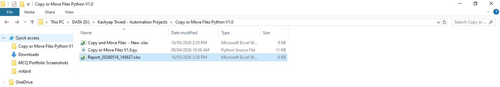
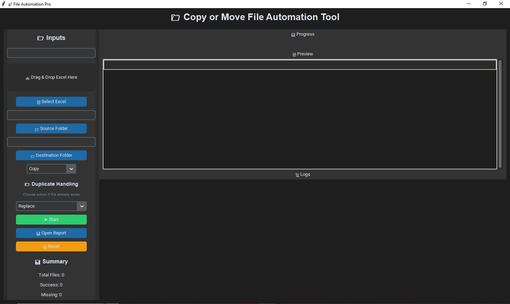
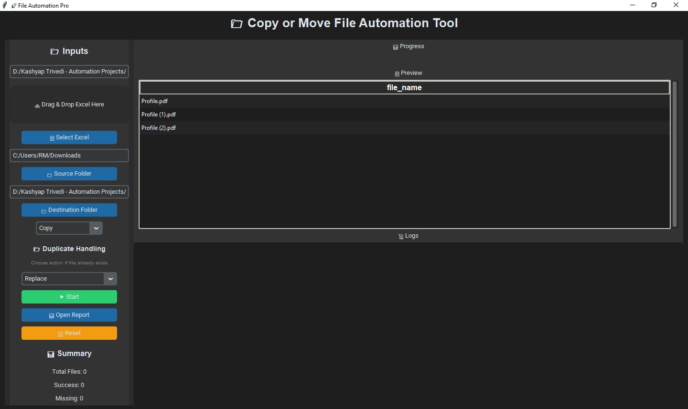
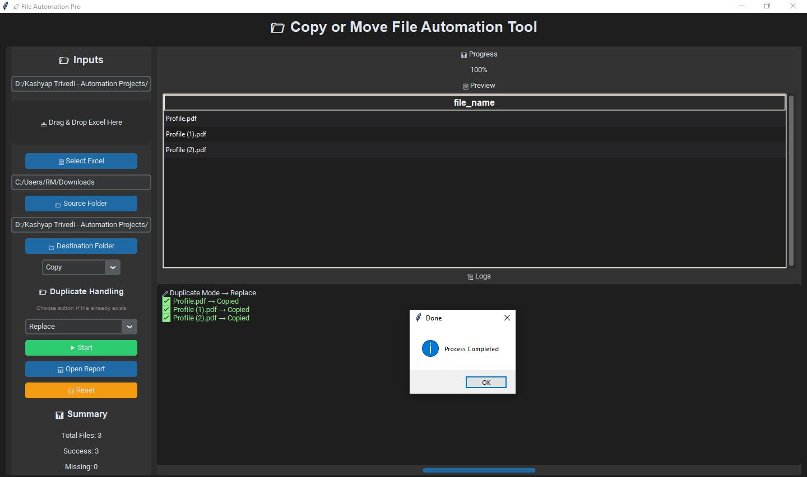
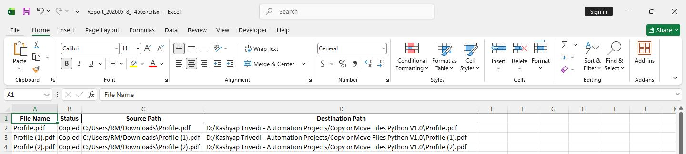

# Python File Retrieval & Automation Tool

## Overview
A Python desktop application designed to automate intelligent file search, retrieval, copy/move workflows, and structured reporting.

This project demonstrates practical business automation by solving repetitive file management challenges across large folder structures.

The public repository is a professional portfolio showcase version of a production-style utility application.

---

## Business Problem
In operational environments, files are often distributed across deeply nested folder structures containing thousands of documents.

Manual challenges include:

- searching for hundreds of specific files
- navigating multiple subfolders
- repetitive copy/paste operations
- duplicate file handling
- tracking missing files
- maintaining movement logs
- generating execution reports

Manual execution is time-consuming, repetitive, and prone to human error.

---

## Solution Approach
This automation utility provides a structured workflow:

Excel File List Input  
↓  
Root Folder Selection  
↓  
Recursive File Search  
↓  
Match Identification  
↓  
Copy / Move Automation  
↓  
Duplicate Handling Logic  
↓  
Execution Logging  
↓  
Automated Report Generation

---

## Key Features
- Desktop GUI application
- Excel-based file input workflow
- recursive folder scanning
- intelligent file retrieval
- copy/move automation
- duplicate file handling
- execution logs
- progress tracking
- automated report generation

---

## Tech Stack
- Python
- CustomTkinter / Tkinter
- Pandas
- OpenPyXL
- OS / File System Automation
- Excel Automation
- Desktop Application Development

---
## Project Screenshots

### Project Structure

### Application Home Screen

### Workflow Configuration

### Execution Completion

### Automated Report Output

## Portfolio Note
This repository is a public showcase version created for professional portfolio purposes.

Production implementation and internal operational code are intentionally excluded.

---

## Author
Kashyap Trivedi

LinkedIn:
https://www.linkedin.com/in/kashyaptrivedii
